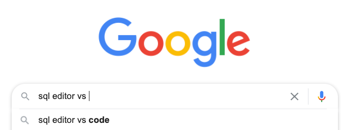

### Overview 

Inspired by [this blog post](https://medium.com/applied-data-science/the-google-vs-trick-618c8fd5359f), this script takes a list of search terms as inputs and returns a .csv output file containing the top 10 autocomplete suggestions generated from a Google search formatted as 'search term' vs. 'output'.

### Use cases

#### Marketing:

Generate new keywords to bid on for competitor search advertising purposes, or highlight potential new competitors. 

#### Personal:

Discover new brands, products, artists etc. that may be similar to the search term entered.

#### Data visualization:

Creating ego graphs for data visualization
